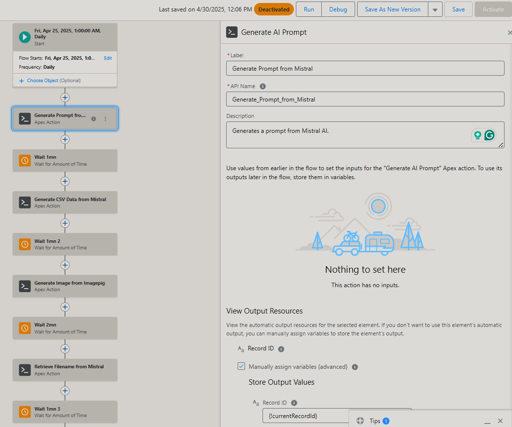
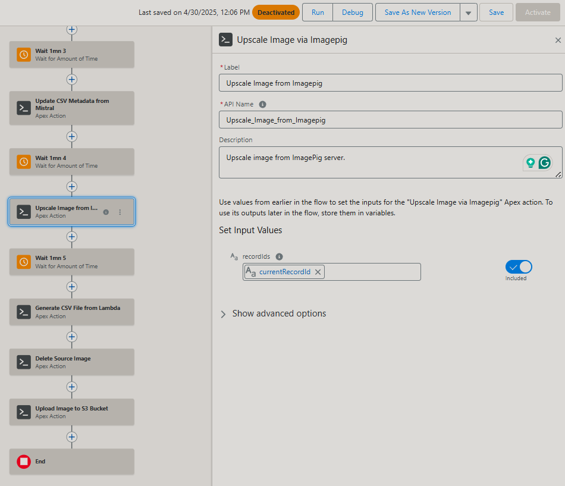
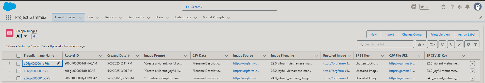
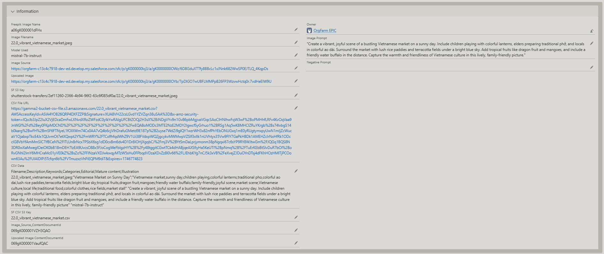

# gamma-2
<h1>Project Gamma 2</h1>

<h2>Automation of AI-generated images production, corresponding metadata files, and upload to hosting servers.</h2> 

While setting this project in your Salesforce org, add the following Apex classes and connect them with a schedule or automated flow so that they can be launched one after the other.

Be sure to set the API keys of your own accounts in the Salesforce Secure Credentials storage and allow the URL to be reached by your org (Check URL security settings)  

You must create a custom object that will be used to store the data in custom fields. 

Step 1: A first Apex class generates a text prompt and stores it in a field. 

Step 2: A second Apex class generates a text that will be exported as a .csv file when calling to the AWS Lambda Python script.

Step 3: A third Apex class uses the previous prompt to generate an image by calling an AI.

Step4: A fourth Apex class uses the same prompt to generate the image filename.

Step 5: A fifth Apex class updates the CSV metadata with the new filename.

Step 6: A sixth Apex class upscales the image to be compliant with the hosting websites' requirements.

Step 7: A seventh Apex class calls a Python function hosted on AWS Lambda 

Step 8: The AWS Lambda file executes: 
    1.Hosts the upscaled image on S3 Bucket ; 
    2.Exports the CSV text into a .csv file on S3 Bucket ; 
    3.Launches an FTP transfer to a specialized hosting server (Shutterstock, Freepik, Adobe Cloud, etc.)

<strong>The flow in Salesforce, with the Apex classes succeeding each others:</strong>

<strong>The record created and the corresponding fields:</strong>

<strong>Example of an image automatically generated:</strong>
